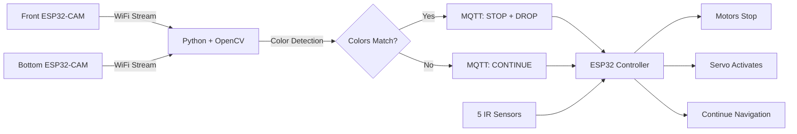

# 🎨 Color Courier
### Autonomous Color-Detecting Line-Following Robot

<div align="center">


</div>

---

## 🌟 Project Overview

**Color Courier** is an intelligent autonomous robot that combines **computer vision**, **IoT communication**, and **embedded systems** to create a smart sorting solution. The robot follows colored lines while simultaneously detecting colored objects, making real-time decisions to sort cargo based on color matching.

### 💡 The Challenge

Developed an automated material handling system for warehouses and laboratories where items need to be transported between workstations and sorted efficiently without human intervention.

### ✨ The Solution

A mobile robot equipped with:
- **Dual ESP32-CAM system** for simultaneous environment and object monitoring
- **Python-based computer vision** for real-time color detection
- **MQTT IoT protocol** for wireless command transmission
- **5-sensor line following** for precise autonomous navigation
- **Servo-actuated sorting platform** for automated cargo release

---

## 🎯 Key Features

<table>
<tr>
<td width="50%">

### 🤖 **Autonomous Navigation**
- 5-sensor IR array for line detection
- Adaptive speed control
- Sharp turn capabilities
- Obstacle-aware movement

</td>
<td width="50%">

### 👁️ **Computer Vision**
- Dual camera color detection
- HSV color space analysis
- 7 color recognition (R/G/B/Y/O/P/Pink)
- Real-time video processing

</td>
</tr>
<tr>
<td width="50%">

### 📡 **IoT Communication**
- MQTT wireless protocol
- WiFi-enabled control
- Low-latency messaging
- Reliable command delivery

</td>
<td width="50%">

### 🔄 **Smart Sorting**
- Automatic color matching
- Timed servo activation
- Cargo release mechanism
- Continuous operation

</td>
</tr>
</table>

---

## 🎬 How It Works



### Process Flow

1. **📹 Capture**: Two ESP32-CAMs stream video over WiFi
2. **🔍 Detect**: Python analyzes frames using OpenCV for color identification
3. **⚖️ Compare**: System matches front camera (box) with bottom camera (line)
4. **📨 Communicate**: MQTT message sent to ESP32 controller
5. **🛑 Act**: Robot stops, servo rotates 90° for 3 seconds to release cargo
6. **🔁 Continue**: Robot resumes line following using IR sensors

---

## 🛠️ Technical Stack

### Hardware Architecture

| Component | Model/Type | Purpose |
|-----------|------------|---------|
| **Microcontrollers** | ESP32-CAM (×2) | Video streaming & WiFi connectivity |
| | ESP32 DevKit | Main robot controller |
| **Sensors** | IR Sensor Array (5×) | Line detection & navigation |
| **Actuators** | DC Motors (2×) | Locomotion |
| | Servo Motor (SG90) | Sorting platform (90° rotation) |
| **Power** | Motor Driver (L298N) | Motor control & power distribution |
| **Compute** | PC/Laptop | Python processing & MQTT broker client |

### Software & Libraries

**Python Stack:**
```python
opencv-python    # Computer vision & image processing
numpy           # Numerical computations
paho-mqtt       # MQTT client implementation
```

**ESP32 Libraries:**
```cpp
WiFi.h          // Wireless connectivity
PubSubClient.h  // MQTT protocol
ESP32Servo.h    // Servo motor control
```

---

## 🖼️ System Architecture

<div align="center">

```
┌─────────────────────────────────────────────────────────────┐
│                     PYTHON PROCESSING UNIT                   │
│  ┌────────────┐    ┌─────────────┐    ┌────────────────┐   │
│  │  OpenCV    │───▶│   Color     │───▶│  MQTT Client   │   │
│  │  Capture   │    │  Detection  │    │  (Publisher)   │   │
│  └────────────┘    └─────────────┘    └────────────────┘   │
└──────────▲─────────────────────────────────────▲────────────┘
           │                                     │
        WiFi Stream                          MQTT Msg
           │                                     │
┌──────────┴────────┐                 ┌──────────┴─────────────┐
│   ESP32-CAM       │                 │   ESP32 CONTROLLER     │
│   ┌───────────┐   │                 │  ┌──────────────────┐  │
│   │  Front    │   │                 │  │  MQTT Subscriber │  │
│   │  Camera   │   │                 │  └────────┬─────────┘  │
│   └───────────┘   │                 │           │            │
└───────────────────┘                 │  ┌────────▼─────────┐  │
                                      │  │  Line Follower   │  │
┌───────────────────┐                 │  │     Logic        │  │
│   ESP32-CAM       │                 │  └────────┬─────────┘  │
│   ┌───────────┐   │                 │           │            │
│   │  Bottom   │   │                 │  ┌────────▼─────────┐  │
│   │  Camera   │   │                 │  │   Motor Driver   │  │
│   └───────────┘   │                 │  └──────────────────┘  │
└───────────────────┘                 │  ┌──────────────────┐  │
                                      │  │  Servo Control   │  │
                                      │  └──────────────────┘  │
                                      └────────────────────────┘
```

</div>

---

## 🎨 Color Detection System

The system uses **HSV color space** for robust color detection under varying lighting conditions:

| Color | HSV Range | Use Case |
|-------|-----------|----------|
| 🔴 Red | H: 0-10, 170-180 | High-priority items |
| 🟠 Orange | H: 11-25 | Medium priority |
| 🟡 Yellow | H: 26-35 | Standard items |
| 🟢 Green | H: 36-85 | Safe/approved items |
| 🔵 Blue | H: 86-130 | Cold storage items |
| 🟣 Purple | H: 131-160 | Special handling |
| 🩷 Pink | H: 161-169, 0-10 | Fragile items |

**Detection Algorithm:**
- Analyzes 40×40 pixel region at frame center
- Applies color range masks in HSV space
- Counts matching pixels per color
- Selects dominant color based on highest pixel count

---

## 🚧 Engineering Challenges & Solutions

### Challenge 1: Arduino + Bluetooth Limitations ❌

**Problem:** 
- Unreliable connections requiring frequent reconnection
- Limited range (~10m)
- High latency for real-time commands
- Difficult debugging process

**Solution:** ✅ Migrated to **ESP32 platform**
- Built-in WiFi with extended range
- Faster processing (dual-core 240MHz)
- Multiple GPIO pins
- Native MQTT support
- Stable, low-latency communication

### Challenge 2: HTTP vs MQTT Communication

**Why HTTP Failed:** ❌
- Request-response overhead
- Connection setup/teardown latency
- Not designed for continuous commands
- Poor performance for IoT applications

**Why MQTT Succeeded:** ✅
- Lightweight publish-subscribe model
- Persistent connection
- QoS (Quality of Service) guarantees
- Designed for IoT and embedded systems
- Sub-millisecond message delivery

### Challenge 3: System Integration

**Individual modules worked perfectly, but integration revealed:**
- Camera streaming latency when both ESP32-CAMs operated simultaneously
- MQTT message synchronization with frame detection timing
- Intermittent WiFi disconnections affecting reliability
- Power stability issues with ESP32-CAM modules

**Solutions Implemented:**
- Frame rate optimization and buffer management
- MQTT QoS level 1 for guaranteed delivery
- WiFi reconnection logic with exponential backoff
- Stable 5V power supply with adequate current (>500mA per camera)

---

## 📊 Performance Metrics

- **Color Detection Accuracy**: ~95% under controlled lighting
- **Line Following Precision**: ±2cm deviation at 20cm/s
- **Response Time**: <100ms from detection to motor action
- **WiFi Range**: Tested up to 15 meters
- **Servo Activation Time**: 3 seconds (configurable)
- **Camera Resolution**: 640×480 @ 15fps per camera

---

## 🚀 Quick Start Guide

### Prerequisites

```bash
# Install Python dependencies
pip install opencv-python numpy paho-mqtt

# Arduino Libraries (via Arduino IDE Library Manager)
- WiFi (built-in with ESP32 board package)
- PubSubClient by Nick O'Leary
- ESP32Servo by Kevin Harrington
```

### Setup Steps

**1. Configure ESP32-CAM Modules**
```cpp
// Upload CameraWebServer example
// Update WiFi credentials
const char* ssid = "YOUR_WIFI_SSID";
const char* password = "YOUR_PASSWORD";
// Note the IP addresses shown in Serial Monitor
```

**2. Update Python Script**
```python
# Set camera stream URLs
CAMERA_URL_1 = "http://192.168.8.101:81/stream"  # Front
CAMERA_URL_2 = "http://192.168.8.102:81/stream"  # Bottom

# Configure MQTT broker
MQTT_BROKER = "broker.hivemq.com"  # Or your broker
```

**3. Configure ESP32 Controller**
```cpp
// WiFi settings
const char* ssid = "YOUR_WIFI_SSID";
const char* password = "YOUR_PASSWORD";

// MQTT settings (must match Python)
const char* mqtt_server = "broker.hivemq.com";
const char* mqtt_topic = "linefollow/colormatch";
```

**4. Run the System**
```bash
# Terminal 1: Start Python color detection
python python_code.py

# The robot will automatically start line following
# Watch the console for color detection output
```
